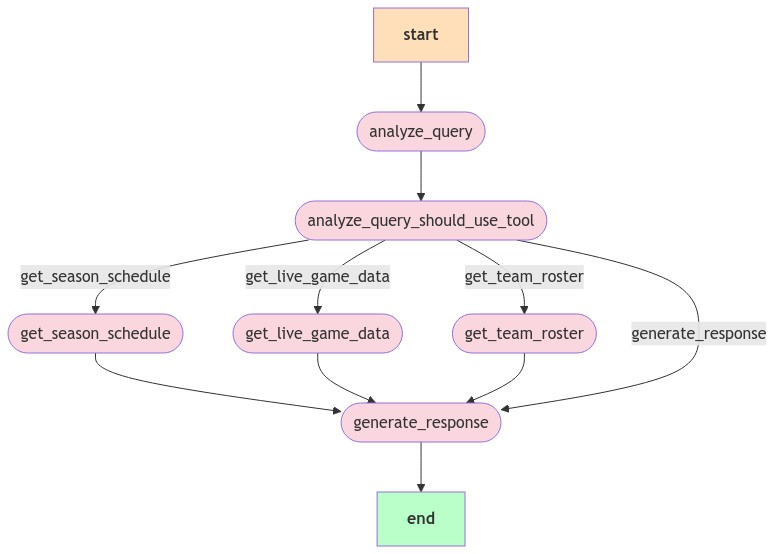

# MLB Stats Central

## Overview
MLB Stats Central is a web application that provides comprehensive statistics, player profiles, and game analyses for Major League Baseball. Users can view leaderboards, upcoming games, and the latest news in the baseball world. The application leverages the Langraph framework for efficient tool invocation and workflow management.

## Architecture
Below is the workflow diagram of our MLB agent system built with Langraph:



## Features
- **Player Statistics**: View detailed statistics for players, including batting averages, home runs, and more.
- **Team Rankings**: Check the rankings of MLB teams based on various metrics.
- **Game Analysis**: Analyze game highlights and player performances.
- **Latest News**: Stay updated with the latest news in the MLB.
- **User-Friendly Interface**: An intuitive and responsive design for a seamless user experience.

## Technologies Used
- **Frontend**: React, TypeScript, Tailwind CSS
- **Backend**: Python, Flask, Langraph
- **Database**: PostgreSQL
- **APIs**: MLB API for real-time data
- **Agent Framework**: Langraph for tool orchestration and workflow management

## Installation

### Prerequisites
- Node.js (v14 or higher)
- Python (v3.7 or higher)
- PostgreSQL
- Langraph


### Frontend Setup
1. Navigate to the frontend directory:
   ```bash
   cd frontend
   ```
2. Install dependencies:
   ```bash
   npm install
   ```
3. Start the development server:
   ```bash
   npm start
   ```

### Backend Setup
1. Navigate to the backend directory:
   ```bash
   cd backend
   ```
2. Create a virtual environment:
   ```bash
   python -m venv venv
   source venv/bin/activate  # On Windows use `venv\Scripts\activate`
   ```
3. Install dependencies:
   ```bash
   pip install -r requirements.txt
   pip install langraph
   ```
4. Set up the database (make sure PostgreSQL is running):
   ```bash
   python manage.py db init
   python manage.py db migrate
   python manage.py db upgrade
   ```
5. Start the backend server:
   ```bash
   python app.py
   ```

## Usage
- Open your browser and navigate to `http://localhost:3000` for the frontend.
- The backend API will be available at `http://localhost:5000/api`.

## Contributing
We welcome contributions! Please follow these steps:
1. Fork the repository.
2. Create a new branch (`git checkout -b feature/YourFeature`).
3. Make your changes and commit them (`git commit -m 'Add some feature'`).
4. Push to the branch (`git push origin feature/YourFeature`).
5. Open a pull request.

## License
This project is licensed under the MIT License - see the [LICENSE](LICENSE) file for details.

## Acknowledgments
- Thanks to the contributors and the open-source community for their support.
- Special thanks to the MLB API for providing real-time data.

## Contact
For any inquiries, please reach out to jonathan.batista.ferreira.m@gmail.com
